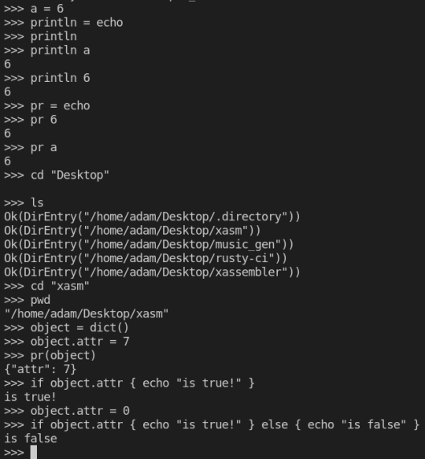

I used to dislike PowerShell very very much, but now I’ve become inspired by it. I was completely unaware of its Object Oriented features, and I think it’s a genius idea. Although I still dislike the implementation, PowerShell is a beautiful concept.

In the Bash shell, every program returns an exit code. In PowerShell, however, everything returns a table. This is extremely useful for organizing data, and it can be extremely efficient. Operations like filtering files by their size can become really simple.

Having been inspired, I started work on my own shell. Using the abstract syntax tree of xasm and slightly rewriting the parser, I was able to very quickly write an implementation of my shell, named Dune.

Here’s a demonstration of the very first 0.1.0 version!

As you can see, it’s very basic and ugly right now, but aesthetics are simple to change.

Within a few hours of starting the project, we already have the ability to create tables and index them. We also have the ability to do control flow. While loops are also supported, but this is not shown in the demonstration.

If you want to see my progress on Dune, visit the repository [here](https://github.com/adam-mcdaniel/dune)