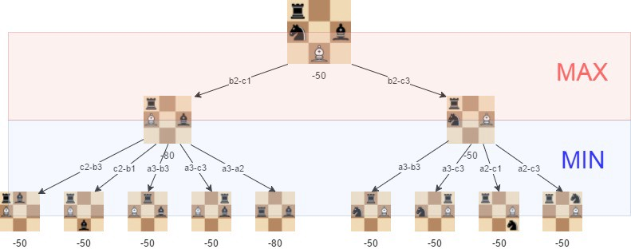

I've written a dependency-free chess engine library in my free time between classes.
## Why write a Chess engine?

Above all, [this video](https://www.youtube.com/watch?v=DpXy041BIlA&t=7s) by [Tom7](http://tom7.org/) is my inspiration for this project. He's absolutely brilliant and I implore you to watch his content.

I love chess a _lot_. It's definitely one of my favorite games ever. However, I've always been disappointed when trying to write programs that play chess digitally (particularly in a compiled language). Although several amazing engines exist, it's near impossible to find a neat library for chess-related-programming that runs on everything.

chess-engine is a solution to my problem. If you want a chess engine that runs on embedded devices, the terminal, [the desktop (with a gui)](https://github.com/adam-mcdaniel/chess-engine/tree/main/examples/chess-gui), _and_ [the web](https://adam-mcdaniel.github.io/chess-engine/docs/book/index.html#average-ai), this is probably your best bet.

## How does it work?

This particular AI (along with most other chess AIs) works using the [Minimax algorithm](https://en.wikipedia.org/wiki/Minimax), along with [Alpha-Beta pruning](https://en.wikipedia.org/wiki/Alpha%E2%80%93beta_pruning) for optimization.

Now, let's unpack that.

The Minimax algorithm essentially iterates through all possible moves recursively, and evaluates all of the boards after the moves are played. If the board is _more_ favorable, it will **encourage** playing its parent move, but if a board is _less_ favorable, then it will select **against** playing a given move.

Additionally, when the AI attempts to see past just the current board, it will assume the human _always_ responds with the best moves. As a result, the computer almost **never** blunders.
This allows the computer to almost always play objectively better moves than the player.

## Embedded in the Web

Because it has zero dependencies, it's extremely simple to embed in the web browser using wasm. Try playing it yourself!

***Average AI Setting:***

  <embed type="text/html" src="https://adam-mcdaniel.github.io/chess-engine/examples/chess-web/chess-best.html" width="420" height="420"/>

### Abusing Minimax

Because Minimax works by simply maximizing the AI's material advantage over the player, it's incredibly simple to abuse the algorithm by changing what it is maximizing.

Here, for example, is the ***opposite*** of a good AI. This AI tries to maximize ***YOUR*** material value, and will desperately try to offer you its pieces while still making legal moves.
***Worst AI Setting:***

    <embed type="text/html" src="https://adam-mcdaniel.github.io/chess-engine/examples/chess-web/chess-worst.html" width="420" height="420"/>

### Chess Variants

Additionally, builtin, chess-engine offers an incredibly simple chess variant called Horde, which I find very fun.

***Horde Chess Variant:***

    <embed type="text/html" src="https://adam-mcdaniel.github.io/chess-engine/examples/chess-web/chess-horde.html" width="420" height="420"/>

Additionally, chess-engine supports getting all of the legal moves for a player. So, naturally, I had to add a random-move AI.

***Random AI Setting:***

    <embed type="text/html" src="https://adam-mcdaniel.github.io/chess-engine/examples/chess-web/chess-random.html" width="420" height="420"/>

