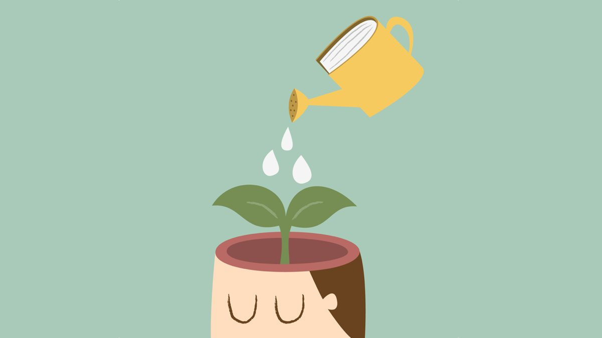

I've been reflecting recently, and decided to record the most important lessons I've learned.

## What I Have Learned

I’ve been writing software almost compulsively since I was 11 years old, when I learned how to use Python to create small, barely playable games for my computer. Since then, I’ve written hundreds of programs, including chess engines, programming languages of my own, custom text editors, and much more. Through my experiences writing and sharing software with the world in competitive environments, I’ve learned a lot about making things, working together with people, and life in general. Here are some of the most important lessons I’ve taken away from my experiences.

1. Be *really* good at one thing. Practice your trade. Don’t stop learning. If you take shortcuts, you will never improve. You can only succeed by slaying the dragon.
2. Be *somewhat* good at a few things. Learn an instrument. Play chess. Paint. Start a blog. It doesn’t have to be huge, just *something*. Building up skill sets in new territories will help you learn other skills easier. Additionally, having an obscure, funny, or particularly difficult skill set can be interesting or memorable to others, which can be great for making new friends or networking.
3. Sometimes failure is the best option. Don’t feel obligated to subject yourself to anything you don’t need to.
4. If you do fail, then fail with purpose. If it’s impossible to make a deadline, sometimes it’s best to just stop and work on something that *can* be finished on time.
5. Perfection is possible, but not the goal. Oftentimes, it’s better to use your effort where it’s best spent than trying to improve something that already works well *enough*. This is particularly true for projects that intend to attract attention: a product’s presentation and demonstration are much more important than its functionality. Make something look good before you make it work well.
6. Don’t worry yourself over things you cannot control. Your time is better spent working towards your future than thinking about what could have been.
7. Always assume *beyond* the worst, and be pleasantly surprised. If you expect more problems than possible, you can never underestimate a workload.
8. All problems are the sum of previously solved problems. Don’t get creative: other people are smarter than you, and their solutions are better. Stand on the shoulders of giants.
9. People have good memories. Only give them positive things to remember you by.
10. Stay close to smart people, but more importantly, stay close to positive people. People who are excited and passionate tend to have something good to be excited and passionate about. Befriend them, and implement what you learn about their happiness in your own life.
11. Humans are incredibly good at problem solving. Don’t be a problem, or someone will find a solution to *you*.
12. If you lose in a fair match, it is because you gave your competition an opportunity you did not foresee or measure properly. Wins are given away, not taken.
13. Be skeptical. The truth has nothing to hide from doubt. Only false assumptions can lead to contradictions. Intuition is a distraction: only believe what you can know for certain. Measurements are more accurate than estimates.
14. Don’t do stupid things. It may not seem obvious, but you *will* regret buying that 10 pound bag of fruit flavored jelly beans.
15. Teach others. Not only does it help other people grow, it strengthens your own skills, too. Teaching is the best form of study.
16. First impressions are everything. If you make mistakes during an interview, or you show up late to your first meeting, your errors will be perceived as character flaws rather than gaffes.
17. Be credible. Only say what you know is true. Never lie, especially to your friends or those who want to help you. If you are uncertain, it is better not to speak.
18. Be kind. Kindness disarms angry individuals, and turns acquaintances into friends. Everyone loves someone who’s nice.
19. Share. After all, what else is that 10 pound bag of fruit flavored jelly beans good for?
20. Have *lots* of fun. Not only does it make you happier, it gives you more things to talk about. Have you ever met a skydiver who couldn’t hold a conversation? Interesting people have crazy stories, so get some of your own.
21. Be grateful for what you have. Although things could be better, they could also be worse.
22. It’s okay to be sad. Go get some Taco Bell, turn on Netflix, and cry as much as you feel like. Skip school today. Don’t do anything you don’t want to. It can wait until tomorrow. I’m proud of you.
