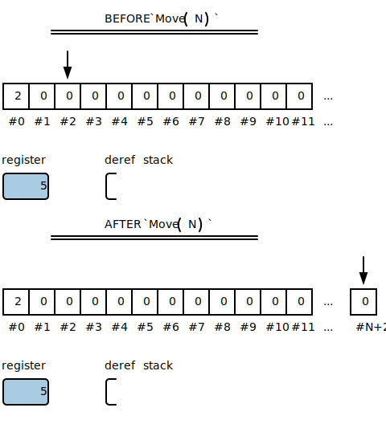
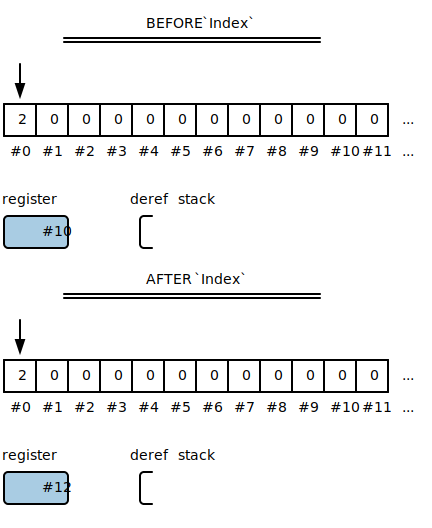
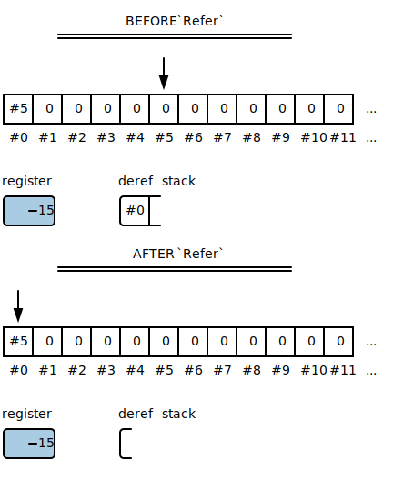
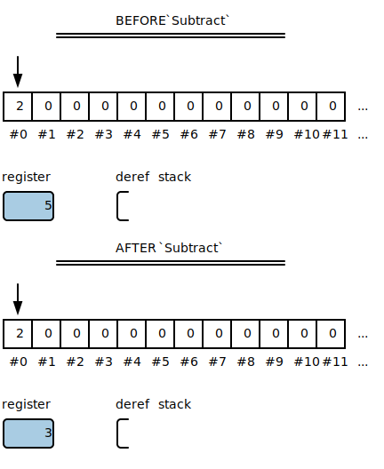
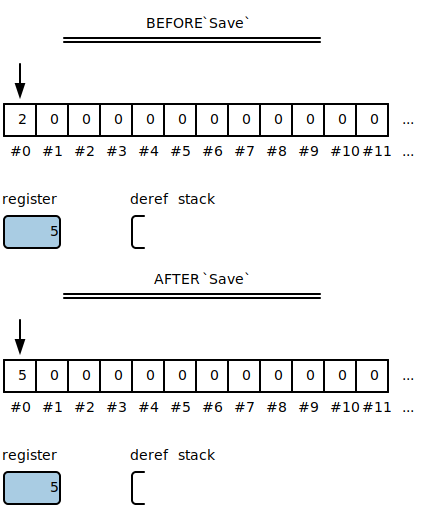
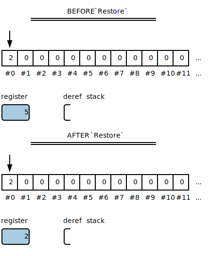
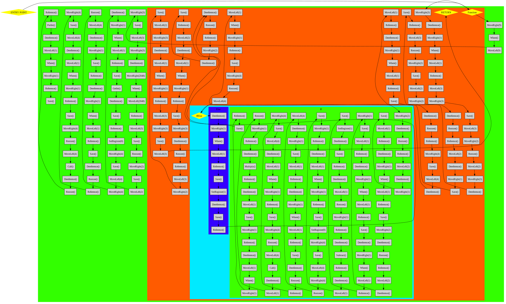
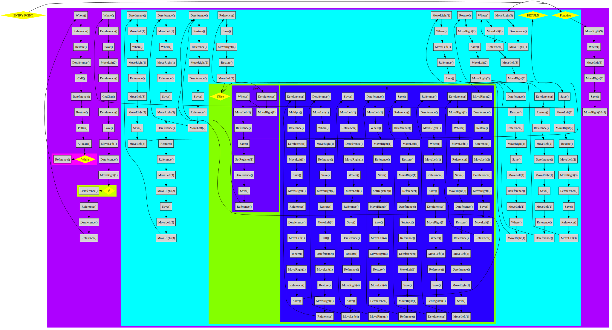

## Index

[Link to the repository](https://github.com/adam-mcdaniel/sage)

1. [The Life Of A Programming Language](#the-life-of-a-programming-language)
2. [An Immortal Language](#an-immortal-language)
3. [Writing Future-Proof Compilers (A Proposed Architecture)](#writing-future-proof-compilers-a-proposed-architecture)
4. [Web Demo](#web-demo)
5. [Applying Evolutionary Algorithms🧬 to the Architecture](#applying-evolutionary-algorithms-to-the-architecture)
6. [Purpose and Use Cases](#purpose-and-use-cases)
7. [Conclusion](#conclusion)

[](https://github.com/adam-mcdaniel/sage)
|***The Script*** |
|:--:|
||

## The Life Of A Programming Language

> In the beginning the *Developer* created the language and the compiler. Now the semantics of the language were formless and empty, undefined declarations were over the face of the headers, and the *Cursor of the Developer* was hovering above the code on the screen.

> And the *Developer* said: **"Let there be types,"** and there were types. The *Developer* saw that the types were good, and they separated the type-safe from the type-unsafe.

A compiler author hits the enter key on their keyboard and their language implementation compiles and runs. The code is *flawless*. The compiler author is happy. The compiler author commits their changes like a responsible developer and goes home for the day.

***Time ticks by and the Earth moves around the Sun.***

The compiler author works on other projects for a time and later returns to their language after a few years. They find that: a dependency requires CPU instructions only available on outdated hardware, one of the libraries won't compile without python2, and old compiled programs no longer run on the latest version of their OS. The compiler author is sad.

> Oh that my programs were recorded! Oh that they were written on a monument! That with an iron stylus and ink of gold they were engraved in electric silicon forever!

The compiler author fixes the issues and commits their changes like a responsible developer and goes home for the day.

***Time ticks by and the Earth moves around the Sun.***

The compiler author is much older. The compiler author writes their philosophy regarding compiler design and semantics in a series of blog posts. While the compiler author is still alive, they are able to confess the *One True Way* to write programs idiomatically and what their compiler is *supposed* to do. A small community of users have gathered, and they rely on the compiler author's implementation for their projects to work. The compiler author is happy. The compiler author commits their changes like a responsible developer and goes home for the day.

***Time ticks by and the Earth moves around the Sun.***

The compiler author is dead. The community for the language has slowly shrunk, and the only remnants of the dialect are a few programs used to check people's tax returns for the next ~1000 years. The compiler author's implementation of the language sits in a repository completely untouched over the ages. These files are the fossils of the language.

> If this world is just, there will be someone who remembers my work! And they will plead my case in front of the Developer most high, demonstrating that the work is good. And my work will be redeemed and considered beautiful, and preserved in that same heavenly museum that houses all the other beautiful inventions!

***Time ticks by and the Earth moves around the Sun.***


| ***The Fossil*** |
|:--:|
||

Decades have passed. Hardware has transformed. 64 bit code support is obsolete. Manufacturers are transitioning away from traditional x86 based assembly architectures and using the new McDonald's "McLambda-Bitecode" CPU (I'm lovin' it™) powered by the legendary STBLC (Simply-Typed-Binary-Lambda-Calculus) instruction set architecture.

The compiler author's language is not only dead, it is *buried*. The language is decomposing in its repository while time eats it up. To run any of the compiler author's programs now, a new implementation of the language must be written from scratch. The fate of the language depends on how difficult it is to resuscitate the language from its grave.

*Will a machine ever sing a song in this tongue again?*

## An Immortal Language


| ***The Immortal Language*** |
|:--:|
||

A language is truly mortal when it is too difficult to resuscitate from the dead. Similarly, a language is immortal when it is easy to resuscitate from the dead.

One example of an immortal language is BrainF*$!. A novice programmer can implement a BrainF^%@ compiler in a single sitting. Any program written in BrainF&~+ will be simple to support by a compiler written in any general purpose programming language in the future. BrainF!@# is immortal.

| BrainF%=" Instruction | C Source Code Equivalent |
|-|-|
|`>`|`++ptr;`|
|`<`|`--ptr;`|
|`+`|`++(*ptr);`|
|`-`|`--(*ptr);`|
|`.`|`putchar(*ptr);`|
|`,`|`*ptr = getchar();`|
|`[`|`while (*ptr) {`|
|`]`|`}`|

This language is immortal because the *complexity* of the language is so minimal. The trade off in BrainF\\{& is that the complexity is shifted into the source code. The only way to simplify the source code is to take on more complexity in the language. This is the trade off of immortality. An immortal language must balance both the complexity required to implement the language and the complexity of source code required to implement any possible algorithm.

> And a voice from heaven said, "This is my *Compiler*, whom I love; with it I am well pleased."

The goal of a compiler author is that their language live. Their language is the embodiment of their programming philosophy (or some subset of their philosophy) and a part of their legacy. The compiler author *ought* to balance the complexity of the language and the complexity of the source code so that their language is immortal. The compiler author *ought* to express their language with the smallest set of architecture dependent primitives necessary. If they do not, their language will be choked by the thorns and thistles and will eventually suffocate from the unnecessary effort required to port the language due to the extra complexity.

> The wages of complexity and unportability are obsolescence, but the free gift of simplicity is eternal support.

## Writing Future-Proof Compilers (A Proposed Architecture)


| ***The Law*** |
|:--:|
||

BrainF\*! is a simple language, but it is not a *useful* language. It is not useful for many reasons:

1. It's not expressive enough to simply represent the logic of real world problems.
2. [As a compiler target, it is not efficient. Addition is `O(N)`.](https://github.com/adam-mcdaniel/harbor) For a language to be useful, it must *at least* be able to implement any algorithm in the smallest possible time complexity (and ideally space complexity, but this might be less important).
3. It is *incomplete* for general purpose use. There is functionality that developers need that can't be implemented in BrainF\*!. For example, there is no way to compile a program that reads a file from disk, because there is no way to call foreign functions.

Compiler authors want to write useful languages, so the language must be able to express the logic of real world problems. The language must be able to implement any algorithm in the smallest possible time complexity. The language must be able to call foreign functions. The language must be able to do all of this while being as simple as possible.

What might a language look like that is simple, expressive, and efficient? What might a language look like that is *future-proof*?

I propose the following architecture for a future-proof language: a Turing tape architecture with a register and a read/write head over the tape. The architecture is simple to understand, and a compiler for the instruction set could easily be implemented by a freshman computer science student. The architecture is flexible enough to represent real world problems efficiently, 1:1 with common programming constructs.

[***Click here to skip directly to the web-demo of the compiler.***](#web-demo)

### The Primordial Prelude

>  And the *Developer* made the tape, and divided the cells which were to the left on the tape from the cells which were to the right on the tape: and it was so.

This prelude demonstrates the types of all the primitives necessary to implement this language. The Turing tape architecture, much like BrainF/\*!, is very simple to port, but it is much more expressive, efficient, and *complete*.

```c
// The cells of the Turing tape can be interpreted as an integer, a float, or a pointer.
union cell {
    long long int i;
    double f; // Optional for floating point support.
    union cell *p;
}   // The tape is a contiguous array of cells.
    tape[200000],
    // The tape pointer
    *ptr = tape,
    // A stack containing the list of previous tape pointer positions.
    *refs[1024],
    // The stack pointer for the list of previous tape pointer positions.
    **ref = refs,
    // The register.
    reg;

// An array containing the defined labels.
void (*labels[10000])(void);
```

### The Core Instructions


|***The Tree Of Eternal Support***|
|:--:|
||

> This is the written account of the *Instruction Set*'s family line, the language of the *Developer*, the immortal tongue:

1. `Function`, which defines the `N++`th function in the program.
2. `Call`, which calls the `N`th function defined in the program, where `N` is the integer stored in the register.
3. `Return`, which returns from the current function.
4. `While`, which loops until the matching `End` instruction while the value stored in the register is not zero.
5. `If`, which conditionally jumps to the matching `Else` or `End` instruction if the value stored in the register is zero.
6. `Else`, which marks the end of an `If` block and the beginning of an `Else` block.
7. `End`, which marks the end of an `If`, `Else`, `While`, or `Function` block.
8. `IsNonNegative?`, which sets the value stored in the register to 1 if the value stored in the register is non-negative, and 0 otherwise.
9. `Where?`, which stores the current tape pointer in the register.
10. `Deref`, which sets the tape pointer to the value stored under the tape pointer.
11. `Refer`, which undoes a matching `Deref` operation.
12. `Index`, which applies `Move(N)` to the pointer stored in the register, where `N` is the value stored in the tape at the current pointer.
13. `Move(Int)`, which moves the tape pointer by the given integer; positive is right, negative is left.
14. `Set(Int)`, which sets the register to the given integer.
15. `Save`, which saves the value stored in the register to the tape at the current pointer.
16. `Restore`, which restores the value stored in the register from the tape at the current pointer.
17. `BitwiseNand`, which performs a bitwise NAND operation on the value stored in the register and the value stored in the tape at the current pointer.
18. `Add`, which adds the value stored under the tape pointer to the value stored in the register.
19. `Subtract`, which subtracts the value stored under the tape pointer from the value stored in the register.
20. `Multiply`, which multiplies the value stored under the tape pointer by the value stored in the register.
21. `Divide`, which divides the value stored in the register by the value stored under the tape pointer.
22. `Remainder`, which sets the value stored in the register to the remainder of the value stored in the register divided by the value stored under the tape pointer.
23. `Get(Channel)`, which gets a `Cell` from an input device's channel and stores it in the register.
24. `Put(Channel)`, which puts the `Cell` stored in the register to an output device's channel.

> Thus there are eight instructions in *Control Flow*, eight instructions in *Memory Manipulation*, six instructions in *Arithmetic*, and two instructions in *I/O*.

These are instructions that *must* be implemented for every target, although the implementation of the `Get` and `Put` input and output devices depends on the hardware executing the program; not all hardware has a keyboard and a screen, so compilers for targets aren't required to implement all of the `Get` and `Put` input and output device interfaces. Foreign function calls are implemented in the expanded ["standard" instructions](#the-standard-instructions), which aren't required to be implemented by every compiler.

Below are diagrams for all of the core instructions, accompanied by slightly more in-depth descriptions of each instruction with some C psuedocode examples.

[***<p style="text-align: center;">Click here to skip the diagrams.</p>***](#the-standard-instructions)

### The Core Instructions In Detail

#### Move

The `Move` instruction takes a constant integer as an argument: the number of cells to move the pointer. The number of cells can be either positive or negative.



#### Index

The `Index` instruction moves the register's value as a pointer by the value pointed to on the tape. For any N stored on the tape under the pointer, the address stored in the register will move by N cells. If N is negative, it will move the pointer in the register N cells to the left. If N is positive, the pointer will move to the right.

This is to account for the fact that the virtual machine is abstracted over pointers. Pointers, under the hood, are varying distances apart for different implementations. For implementations using an indexed array as a tape, the "address" of each cell is the previous address plus one. For implementations using **real pointers**, this difference can be 2, 4, 8 or who knows what: it depends on the implementation. So, to write code that uses pointers *without understanding how they work*, we need the `Index` instruction along with `Where?`, `Deref`, and `Refer`.



#### BitwiseNand

`BitwiseNand` performs a bitwise-NAND operation on the register and the tape, and stores the result in the register. This should perform a bitwise-NAND across all the bits which represent the cell. I would ideally like to ground bitwise operations in a more mathematical way, but this is good for now. I don't necessarily like the concept of forcing a target to implement cells in terms of bits, though.


#### Where?

`Where?` sets the register equal to the current value of the pointer: `reg = ptr`. Consider an implementation of the VM that uses *actual pointers* to implement the turing tape. Using cell indices as addresses simply doesn't work: you can't dereference addresses like `0x00000005` on the hardware. This instruction helps the VM abstract any implementation details about the memory, while still allowing enough flexibility to be interoperable with different representations of pointers. With `Where?`, the VM can use either cell indices or real pointers to implement the tape without the compiler needing to know the difference.


#### Deref and Refer

The `Deref` instruction saves the current pointer to the "deref stack", and *dereferences* the address stored at the pointer: `push(ptr); ptr = *ptr`. The `Refer` undoes the last `Deref` instruction. It pops the top pointer off the deref stack, and stores it in the pointer: `ptr = pop()`.

 

#### IsNonNegative?

`IsNonNegative?` is the only operator for comparisons. It sets the register equal to 1 if the register is non-negative, 0 otherwise: `register = register >= 0? 1 : 0`.

#### Math

Each of the arithmetic operators function identically. For addition: `register += *ptr`. For subtraction: `register -= *ptr`. Very straightforward. Division (and remainder) by zero should halt the machine.

##### Add and Subtract

 

##### Multiply and Divide

 

##### Remainder


#### While, If, and Else

The `While` instruction creates a while-the-register-is-not-zero-loop over the block of code terminated by the matching `End` instruction: `while (register != 0) {`.

The `If` instruction functions similarly: it creates an if statement which can have an optional `Else` instruction. If statements are structured either: `If` ... `End`, or `If` ... `Else` ... `End`.

#### Function, Call, and Return

The `Function` instruction declares a function, and is terminated with a matching `End` block. Instructions between the `Function` and `End` block are the function's body. The body of the function is only executed when the function is called.

The `Call` instruction calls the `register`th defined function in the program. If the register is 0, it will call the first function defined in the program. Calling on negative values halts the machine. Whenever the called function returns, it resumes execution where it was called.

The `Return` instruction makes the current function return early. Outside of a function body, this causes the program to terminate.

#### Set

The `Set` instruction takes a constant integer argument, and sets the register to that value.


#### Save and Restore

The `Save` instruction writes the value of the register to the cell at the pointer: `*ptr = register`. The `Restore` instruction is the inverse: `register = *ptr`.

 

#### Get and Put

The `Get` instruction receives a value from the interface I/O device, and stores it in the register. The `Put` instruction sends the value of the register to the interface I/O device.
This I/O device is statically known to the target, and can range from STDIN/STDOUT to a motor device.

#### End

The `End` instruction has no use on its own: its only purpose is to serve as a matching instruction for the `While`, `If`, `Else`, and `Function` instructions.

### The Standard Instructions

[The current standard instruction set.](https://adam-mcdaniel.github.io/sage/sage/vm/enum.StandardOp.html)

The compiler tries to use core instructions only, but will use standard instructions as required by the source code. Code using floating point instructions must use the standard instructions to do those operations. Almost all targets implement the standard instructions, but they are not required to do so. A bare metal target might not have floating point support, for example. Targets don't have to implement *all* of the standard instructions, either. For example, a target might support floats, but not have an allocator, so it would support the floating point `Add` instruction but not `Alloc` or `Free`.

Additionally, the standard instructions implement the `Peek` and `Poke` instructions used for FFI. Any functionality that's outsourced to foreign code must use these instructions. The compiler for the target will then link in the foreign code in accordance with the interfaces used by the `Peek` and `Poke` instructions.

These instruction sets aren't definitive by any means: I want less redundant instructions (Add and Subtract), support for more bit operations like leftshift and rightshift, and functionality for math expressions like logarithms.

All instructions should only operate on the register, the value under the tape, and (optionally) a constant literal argument. This design makes it very easy for an optimizer to make deductions about the state of the tape at any given moment — just short of statically determining all the values under the tape at runtime.

[***Click here to skip directly to the web-demo of the compiler.***](#web-demo)

## A Compiler for the Architecture


|***Babel***|
|:--:|
||

Now we have a simple to implement instruction set that ***could*** (albeit somewhat inconveniently) represent the bulk of our real world problems. More importantly, though, it's possible to create a simple pseudo-assembly language designed over the architecture which translates to the instruction set *1:1*, emulating a stack using predefined tape locations as registers.

```fsharp
fun fact // Factorial function in the pseudo-asm language
    if [FP] // Is the argument non-zero?
        mov [FP], A // Move the argument into register A
        dec A // Decrement A
        push A // Push Argument - 1 onto the stack
        call fact // Call fact with Argument - 1
        mul [FP + 1], [FP] // Multiply the result by the argument
        pop // Pop the argument - 1 off the stack
    else
        // If the argument is zero, return 1
        set [FP], 1
    end
end
```

To really prove that the architecture is viable, I've implemented a compiler for a high level language that targets the instruction set. It has parametric polymorphism⚗️, algebraic data types🧮, pattern matching🎯, and more. The language backend is simple enough that it can easily be ported to platforms like the web, but it's also capable of implementing common algorithms like quicksort or real world algorithms like AES encryption and decryption (Rijndael). The compiler *could* be reimplemented in itself (with a *lot* of effort). The stages of compilation used to create the language are suitable intermediate representations for implementing other languages as well.

This web-demo shows the compiler in action: you can change the output to see the generated IR, the pseudo-assembly, the instruction set code, the equivalent C source, the x86 assembly, and the execution output (the generated instructions are fed into an interpreter after compilation).

### Web-Demo

<embed type="text/html" src="https://adam-mcdaniel.github.io/sage/sage/web/index.html" title="Compiler" width="100%" height="940em"></embed>

***Press the "Compile" button to compile and execute the source code in the editor! Write something in the text-box to supply your programs with input!***

You might worry that the architecture forces the language to compile to a verbose number of instructions, and that this leads to inefficiency despite being portable. Fear not: optimizations can be applied very aggressively to make the code highly performant. A compiler, for example, might implement first class Tensor objects which can be compiled using the simple architectures instructions. An optimizing compiler can discern a matrix multiplication *very easily* just using peephole optimizations on the compiled instructions, and the optimizer can substitute those operations with the equivalent BLAS library calls. This allows programs to be compiled for distribution (write once run anywhere, *and* add a new supported platform in an afternoon), but then it also allows programs to utilize *optimized platform specific code upon execution / lowering to a given target*.

## Applying Evolutionary Algorithms to the Architecture


|***The Creator's Spindle***|
|:--:|
||

I also investigated some interesting properties of the architecture (and other variants of the VM as well) in a research project for one of my graduate classes. [I wrote a program which evolves compiled programs for the instruction set.](https://github.com/adam-mcdaniel/program-evolution) The simple Turing tape architecture is surprisingly well suited to genetic algorithms🧬: the evolutionary program not only has the capability to optimize the compiled output of existing code based on a user-defined fitness function, but it can also evolve VM programs from scratch.

The results of the genetic algorithm were very interesting: one test program's code size (a simple factorial example) shrunk by 20%! An implementation of quicksort shrunk by 2.4%, a much more reasonable but not insignificant result. This was very simple to implement as well. The VM was implemented in Python, and the user-defined fitness function just executes the program and checks the input and output buffers against the expected values for random inputs.

|Factorial Program Before|Factorial Program After|
|:---:|:---:|
|||

#### Quicksort Before


#### Quicksort After


[You can see a more in-depth explanation of the evolutionary process and the results here.](https://github.com/adam-mcdaniel/program-evolution#research-poster)

An optimizing compiler might use these techniques to provide additional optimizations on top of those achieved by inlining and peephole optimizations.


|***The Genome***|
|:--:|
||

## Purpose and Use Cases


|***The Golden Ladder***|
|:--:|
||

*Where does this architecture take us?*

This instruction set is designed to be suitable for scripting-language applications that need to run on any kind of device: thermostats, desktop devices, or mobile phones. It's also designed to be a *convenient*, *safe*, and *long-lasting* glue; programs simply read data in from input channels and write outputs to output channels, and they can interact with optimized foreign code (through a channel) to fill in the gaps. Programs in this architecture are "information plumbers". Additionally, because programs simply think in terms of receiving/sending "cells" to input and output channels, these programs can easily be piped into one another. A program compiled to this instruction set will be guaranteed to run *long* into the future, so you won't have to struggle to run your old programs.

Additionally, sharing programs is *much* safer with this instruction set: it's impossible to jump to an arbitrary address, all memory reads/writes can be bounded to the tape by the implementation, and all interactions with foreign code are mediated by the VM through the `Peek`/`Poke` interface. This means you can run untrusted code without worrying about it bricking your system! Imagine sending a program to your friend over Discord or SMS, and the program automatically executes client-side and becomes interactive with the recipient in a separate thread.

The architecture is *not*, however, suited for applications which demand extreme efficiency: languages which take advantage of hardware-dependent features will always be more suitable for high performance computing. Pseudo-assembly instructions can be reconstructed from the VM instructions, and this can be compiled with hardware-specific optimizations for the given target if performance is needed, but this program would likely not achieve maximum performance for the hardware.

> **If I have told you not to care for target-specific features, and you do not listen, how then will you care if I offer you features welling up into eternal portability?**

You'd be better off writing in C if you need to squeeze every last drop of performance out of your computer. If you want to write a program that needs *long-term operation and portability*, and just needs to be "not slow", then this architecture is suitable.

> Therefore go and make disciples of all developers, teaching them in the name of the Type-system, the Compiler, and the Syntax, and teaching them to obey everything I have commanded you. And surely your code will be with you always, to the very end of the age.

## Conclusion

Wow, now I can compile high level programs using polymorphism and algebraic types down to an architecture that can essentially be assembled for your favorite target with string replacement and a little bit of duct tape! Compiled programs which use this architecture are *at least* guaranteed to be simple to resurrect: *some* degree of immortality. This architecture will survive as long as there are machines with imperative instruction sets, and probably as long as Turing-complete general-purpose-languages that have integers and array-like data structures.

***Time ticks by and the Earth moves around the Sun.***


|***Creation***|
|:--:|
||
